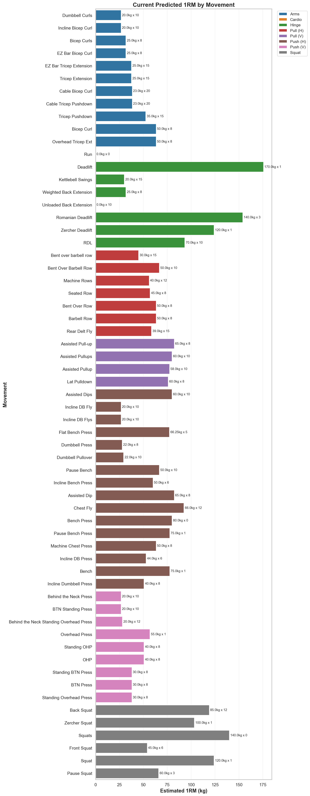
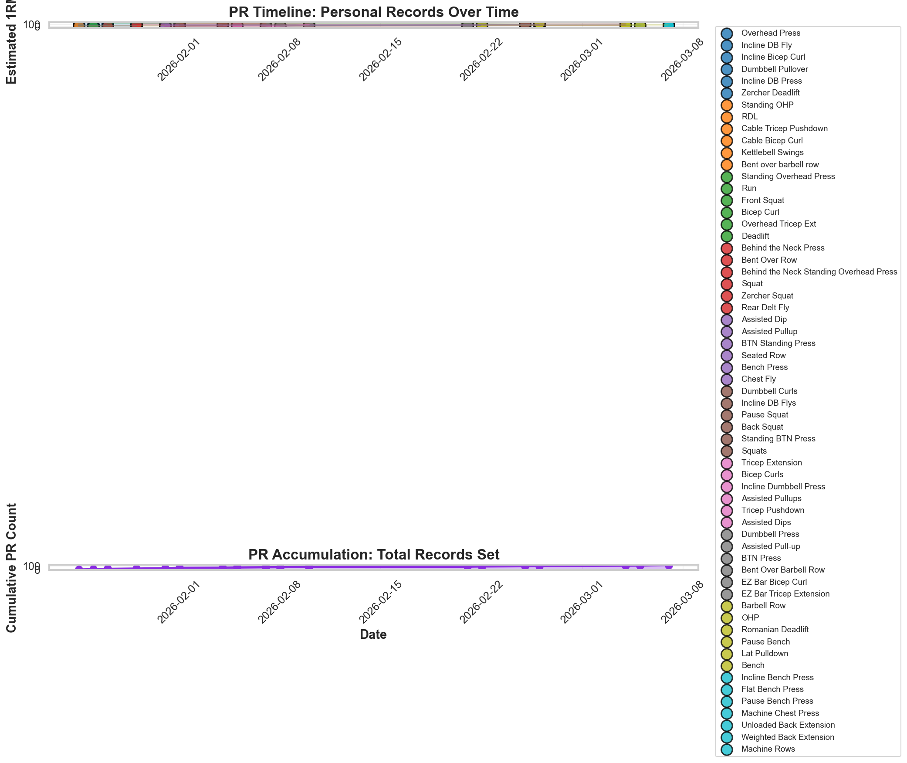
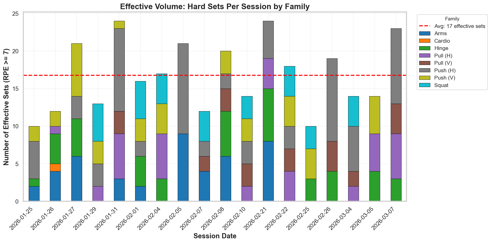
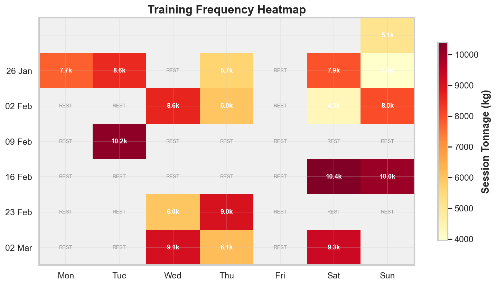
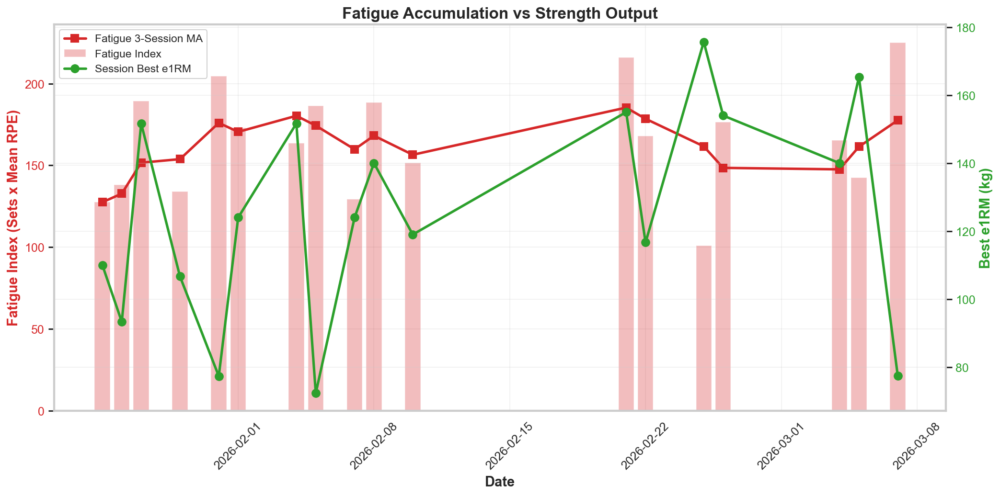

# Lifting Tracker — Dashboard

Personal weightlifting tracker syncing workout JSON files to an Excel log and generating analysis visualisations. Figures below are regenerated each time [`notebooks/update_log.ipynb`](notebooks/update_log.ipynb) is run and reflect the most recent session.

---

## Strength Matrix

Current predicted 1-rep max (e1RM) for every tracked movement, grouped by movement family. Each bar shows the best set on record; the label gives the actual load and reps that produced it. Use this as a quick read on absolute strength across all lifts.

> **e1RM** = `Load_kg × (1 + Reps / 30)` (Epley formula)



---

## PR Timeline & Records

Every personal record set over the full training history, plotted chronologically. Each point is a new all-time best e1RM for that movement. The cumulative PR count (second panel) shows overall momentum — a consistently rising line means strength is still trending upward.



---

## Effective Volume

"Effective" sets (RPE >= 7) per session stacked by movement family. Only sets at or above RPE 7 are counted — these are the sets that meaningfully drive adaptation. The red dashed line is the session average. A family consistently absent from the stack is being trained at too low an intensity to stimulate progress.



---

## Training Frequency Heatmap

Calendar view of every training day, coloured by session tonnage (Volume Load = kg × reps, summed). Darker = heavier session. Use this to spot consistent weekly rhythms, deload periods, and unplanned gaps in training.

> **Volume Load** = `Load_kg × Reps` per set, summed for the session



---

## Fatigue Accumulation

Dual-axis overlay of **fatigue index** (sets × mean RPE, 3-session rolling average) against **session-best e1RM**. When fatigue climbs sharply while e1RM stalls or drops, recovery is falling behind. When fatigue is moderate and e1RM is climbing, training is productive. A sustained high fatigue index without a corresponding strength gain suggests junk volume or insufficient rest.

> **Fatigue index** = `set_count × mean_RPE` per session



---

## Updating the Dashboard

```bash
# Activate virtual environment
source .venv/bin/activate        # Unix
# .venv\Scripts\activate          # Windows

# Run the notebook (all cells sequentially)
jupyter notebook notebooks/update_log.ipynb
```

Any `YYYYMMDD_HHMMSS.json` file placed in `data/` is automatically synced to `data/workout_log.xlsx` on the next run. The figures in `figures/` are overwritten each time.

---

## Workout JSON Format

```json
[
  {
    "Movement": "Back Squat",
    "Load_kg": 100,
    "Reps": 5,
    "Volume_Load": 500,
    "Intensity_RPE": 8,
    "Notes": "Optional"
  }
]
```

Filename must follow `YYYYMMDD_HHMMSS.json` — the timestamp is extracted from the filename for deduplication if not present in the data.

### Movement Family Mapping

| Family | Example Movements |
|--------|-------------------|
| Squat | Back Squat, Front Squat, Zercher Squat, Pause Squat |
| Hinge | Deadlift, Zercher Deadlift, Romanian Deadlift, Kettlebell Swings, Back Extension, Hyperextension |
| Push (H) | Bench Press, Incline BB Press, DB Press, Dips |
| Push (V) | Overhead Press, Standing OHP, DB Shoulder Press |
| Pull (H) | Bent over Barbell Rows, Cable Rows, Seated Row |
| Pull (V) | Pull Ups, Lat Pulldown, Assisted Pullups |
| Arms | Bicep Curl, Tricep Pushdown, Tricep Extension |
| Core | Cable Crunches |
| Cardio | Run |

Movements not in the map are matched by keyword fallback, then labelled "Other" with a warning if no match is found.

---

## File Structure

```
Lifting-Tracking/
├── data/
│   ├── YYYYMMDD_HHMMSS.json   # Workout session files (one per session)
│   └── workout_log.xlsx        # Consolidated log (auto-generated)
├── figures/                    # Exported dashboard figures (auto-generated)
├── notebooks/
│   └── update_log.ipynb        # Main analysis notebook
└── README.md                   # This file
```
